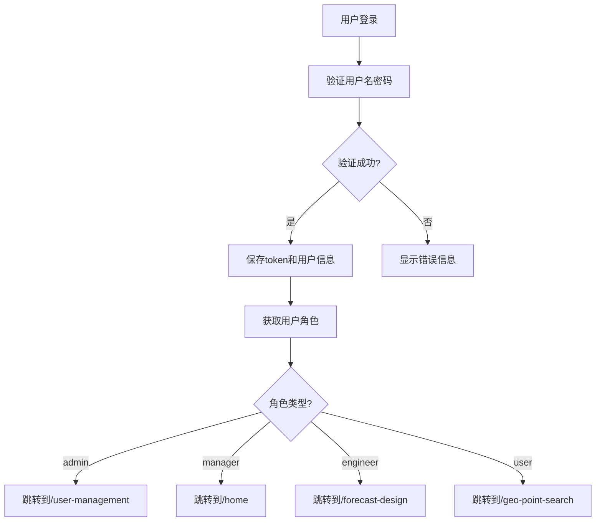

# 基于角色的路由系统使用指南

## 📋 概述

本系统实现了基于用户角色的路由和权限管理，不同角色的用户登录后会跳转到不同的首页，并拥有不同的页面访问权限。

## 🎯 功能特性

### ✅ 已实现的功能

1. **用户管理页面** - 完整的CRUD功能
2. **角色路由配置** - 4种角色的路由映射
3. **登录后角色跳转** - 根据角色自动跳转到对应首页
4. **权限检查工具** - 检查用户是否有权限访问特定路由

### 🎨 用户界面

用户管理页面包含：
- ✅ 用户列表展示（表格）
- ✅ 搜索和筛选（用户名、角色、状态）
- ✅ 新增用户
- ✅ 编辑用户
- ✅ 删除用户
- ✅ 角色标签显示
- ✅ 状态管理（启用/禁用）
- ✅ 分页功能

## 👥 角色定义

系统支持4种用户角色：

| 角色 | 代码 | 权限级别 | 登录首页 | 说明 |
|------|------|----------|----------|------|
| 系统管理员 | `admin` | 最高 | `/user-management` | 拥有所有权限，包括用户管理 |
| 项目经理 | `manager` | 高 | `/home` | 管理和查看项目数据 |
| 技术人员 | `engineer` | 中 | `/forecast-design` | 操作和录入数据 |
| 普通用户 | `user` | 低 | `/geo-point-search` | 仅查看数据 |

## 🗺️ 角色路由映射

### 系统管理员 (admin)

**登录首页**: `/user-management`

**可访问路由**:
- `/home` - 首页
- `/user-management` - 用户管理 ⭐
- `/forecast-design` - 预报设计
- `/geo-point-search` - 工点查询
- `/data-analysis` - 数据分析
- `/system-settings` - 系统设置

### 项目经理 (manager)

**登录首页**: `/home`

**可访问路由**:
- `/home` - 首页
- `/forecast-design` - 预报设计
- `/geo-point-search` - 工点查询
- `/data-analysis` - 数据分析
- `/team-management` - 团队管理

### 技术人员 (engineer)

**登录首页**: `/forecast-design`

**可访问路由**:
- `/home` - 首页
- `/forecast-design` - 预报设计
- `/geo-point-search` - 工点查询
- `/data-entry` - 数据录入

### 普通用户 (user)

**登录首页**: `/geo-point-search`

**可访问路由**:
- `/home` - 首页
- `/geo-point-search` - 工点查询
- `/data-view` - 数据查看

## 📁 文件结构

```
src/
├── pages/
│   └── UserManagementPage.tsx          # 用户管理页面
├── services/
│   └── userAPI.ts                       # 用户管理API
├── config/
│   └── roleRoutes.ts                    # 角色路由配置
├── utils/
│   └── roleAuth.ts                      # 角色权限工具
└── router/
    └── index.tsx                        # 路由配置（已更新）
```

## 🚀 使用方法

### 1. 访问用户管理页面

管理员登录后会自动跳转到用户管理页面：

```
http://localhost:3000/user-management
```

或者在其他页面通过导航访问。

### 2. 测试不同角色登录

使用不同角色的账号登录，系统会自动跳转到对应的首页：

```typescript
// 管理员登录
username: 'admin'
password: '你的密码'
// 登录后跳转到: /user-management

// 项目经理登录
username: 'manager01'
password: '你的密码'
// 登录后跳转到: /home

// 技术人员登录
username: 'engineer01'
password: '你的密码'
// 登录后跳转到: /forecast-design

// 普通用户登录
username: 'user01'
password: '你的密码'
// 登录后跳转到: /geo-point-search
```

### 3. 在代码中使用角色权限

```typescript
import { 
  getCurrentUserRole, 
  checkRoutePermission,
  isAdmin,
  isManager 
} from '../utils/roleAuth';

// 获取当前用户角色
const role = getCurrentUserRole();
console.log('当前角色:', role); // 'admin' | 'manager' | 'engineer' | 'user'

// 检查是否有权限访问某个路由
const canAccess = checkRoutePermission('/user-management');
if (canAccess) {
  // 允许访问
}

// 检查是否是管理员
if (isAdmin()) {
  // 显示管理员功能
}

// 检查是否是项目经理或更高权限
if (isManager()) {
  // 显示管理功能
}
```

### 4. 配置新的角色路由

编辑 `src/config/roleRoutes.ts`:

```typescript
export const ROLE_ROUTES: Record<UserRole, RoleRouteConfig> = {
  admin: {
    role: 'admin',
    roleName: '系统管理员',
    homePage: '/user-management',  // 修改首页
    routes: [
      // 添加新路由
      {
        path: '/new-page',
        name: '新页面',
        icon: 'icon-new'
      }
    ]
  }
  // ... 其他角色
};
```

## 🎨 用户管理页面功能

### 搜索和筛选

```typescript
// 支持的搜索条件
- 用户名/姓名（模糊搜索）
- 角色筛选
- 状态筛选（启用/禁用）
```

### 新增用户

点击"新增人员"按钮，填写表单：

**必填字段**:
- 用户名（至少3个字符，创建后不可修改）
- 密码（至少6个字符，仅新增时需要）
- 姓名
- 手机号（11位，格式验证）
- 邮箱（格式验证）
- 部门
- 角色（从下拉列表选择）
- 状态（启用/禁用）

### 编辑用户

点击"编辑"按钮，修改用户信息：

**可修改字段**:
- 姓名
- 手机号
- 邮箱
- 部门
- 角色
- 状态

**不可修改**:
- 用户名（创建后不可修改）
- 密码（需要通过"重置密码"功能）

### 删除用户

点击"删除"按钮，确认后删除用户。

⚠️ **注意**: 删除操作不可恢复！

## 🔧 API接口

### 用户管理API

所有API定义在 `src/services/userAPI.ts`:

```typescript
// 获取用户列表
getUserList(params: UserQueryParams): Promise<UserListResponse>

// 获取用户详情
getUserDetail(id: string): Promise<BaseResponse<User>>

// 创建用户
createUser(data: UserFormData): Promise<BaseResponse>

// 更新用户
updateUser(id: string, data: Partial<UserFormData>): Promise<BaseResponse>

// 删除用户
deleteUser(id: string): Promise<BaseResponse>

// 批量删除用户
batchDeleteUsers(ids: string[]): Promise<BaseResponse>

// 重置密码
resetPassword(id: string, newPassword: string): Promise<BaseResponse>

// 导出用户数据
exportUsers(params: UserQueryParams): Promise<Blob>
```

### 后端API路径

当前使用Mock数据，后续需要对接真实API：

```
GET    /api/v1/users              # 获取用户列表
GET    /api/v1/users/:id          # 获取用户详情
POST   /api/v1/users              # 创建用户
PUT    /api/v1/users/:id          # 更新用户
DELETE /api/v1/users/:id          # 删除用户
POST   /api/v1/users/batch-delete # 批量删除
POST   /api/v1/users/:id/reset-password # 重置密码
GET    /api/v1/users/export       # 导出数据
```

## 🔄 登录流程



## 📝 Mock数据

当前页面使用Mock数据进行演示：

```typescript
const mockUsers: User[] = [
  {
    id: '1',
    username: 'admin',
    realName: '张三',
    phone: '13800138000',
    email: 'zhangsan@example.com',
    department: '技术部',
    role: 'admin',
    status: 'active',
    createTime: '2024-01-01 10:00:00'
  },
  // ... 更多用户
];
```

## 🔐 权限控制

### 路由守卫

所有受保护的路由都使用 `ProtectedRoute` 组件包裹：

```typescript
<ProtectedRoute>
  <UserManagementPage />
</ProtectedRoute>
```

### 页面级权限

在页面组件中检查权限：

```typescript
import { isAdmin } from '../utils/roleAuth';

function MyPage() {
  if (!isAdmin()) {
    return <div>您没有权限访问此页面</div>;
  }
  
  return <div>管理员页面内容</div>;
}
```

### 功能级权限

在组件中根据角色显示不同功能：

```typescript
import { getCurrentUserRole } from '../utils/roleAuth';

function MyComponent() {
  const role = getCurrentUserRole();
  
  return (
    <div>
      {role === 'admin' && <Button>管理员功能</Button>}
      {(role === 'admin' || role === 'manager') && <Button>管理功能</Button>}
      <Button>所有人可见</Button>
    </div>
  );
}
```

## 🚧 后续集成步骤

### 1. 对接后端用户管理API

修改 `src/pages/UserManagementPage.tsx`:

```typescript
// 替换Mock数据为真实API调用
import { getUserList, createUser, updateUser, deleteUser } from '../services/userAPI';

const loadUsers = async (params?: any) => {
  setLoading(true);
  try {
    const response = await getUserList({
      username: params?.username,
      role: params?.role,
      status: params?.status,
      pageNum: pagination.current,
      pageSize: pagination.pageSize
    });
    
    if (response.resultcode === 200) {
      setUsers(response.data.list);
      setPagination({
        ...pagination,
        total: response.data.total
      });
    }
  } catch (error) {
    Message.error('加载用户列表失败');
  } finally {
    setLoading(false);
  }
};
```

### 2. 实现导航菜单

根据角色动态生成导航菜单：

```typescript
import { getRoutesByRole } from '../config/roleRoutes';
import { getCurrentUserRole } from '../utils/roleAuth';

function Navigation() {
  const role = getCurrentUserRole();
  const routes = getRoutesByRole(role);
  
  return (
    <Menu>
      {routes.map(route => (
        <Menu.Item key={route.path}>
          <Link to={route.path}>{route.name}</Link>
        </Menu.Item>
      ))}
    </Menu>
  );
}
```

### 3. 添加更多角色特定页面

根据需求为不同角色创建专属页面。

## 🎯 测试场景

### 场景1: 管理员登录

1. 使用管理员账号登录
2. 自动跳转到 `/user-management`
3. 可以看到用户管理页面
4. 可以进行增删改查操作

### 场景2: 普通用户登录

1. 使用普通用户账号登录
2. 自动跳转到 `/geo-point-search`
3. 尝试访问 `/user-management` 应该被拒绝或重定向

### 场景3: 角色切换

1. 以管理员身份创建新用户
2. 为新用户分配不同角色
3. 使用新用户登录
4. 验证跳转到正确的首页

## 📊 数据流程

```
用户登录
  ↓
后端验证
  ↓
返回 token + roles
  ↓
保存到 localStorage
  ↓
读取 roles
  ↓
查找角色配置
  ↓
获取首页路径
  ↓
跳转到对应首页
```

## 🔍 调试技巧

### 查看当前角色

```javascript
// 在浏览器控制台执行
console.log('当前角色:', localStorage.getItem('roles'));
```

### 手动切换角色测试

```javascript
// 在浏览器控制台执行
localStorage.setItem('roles', JSON.stringify(['admin']));
// 刷新页面
```

### 查看路由配置

```javascript
import { ROLE_ROUTES } from './config/roleRoutes';
console.log('所有角色配置:', ROLE_ROUTES);
```

## ⚠️ 注意事项

1. **目前使用Mock数据** - 用户管理页面的所有操作都是前端模拟，需要对接后端API
2. **登录逻辑已集成** - 登录后会根据角色自动跳转
3. **路由守卫已配置** - 所有页面都需要登录才能访问
4. **权限检查需完善** - 建议在路由守卫中添加角色权限检查

## 📚 相关文档

- [API实现指南](./API-IMPLEMENTATION-GUIDE.md)
- [登录问题排查](./LOGIN-TROUBLESHOOTING.md)
- [项目分析报告](./PROJECT-ANALYSIS-REPORT.md)

---

**创建时间**: 2024年11月16日  
**版本**: 1.0.0  
**状态**: ✅ 开发完成，待集成后端API
